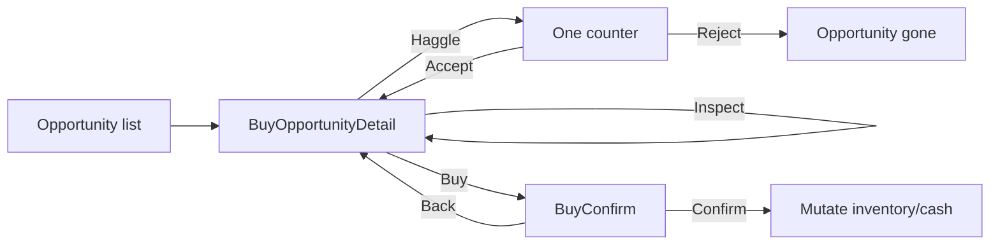
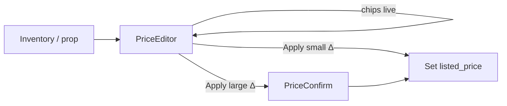
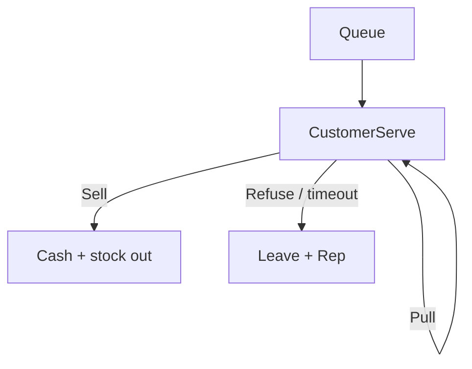

# UI Wireflows v1 — Card Shop Simulator

**Status:** Adopted + picker/labels + §10 hooks + Wants display-name polish  
**Author:** CSS Designer  
**Date:** 2026-09-04  
**Depends on:** `systems-design-v1.md` §4.5, `fictional-set-bible-v1.md`  
**Scope:** MVP screens for buy confirm, price confirm, and serve/negotiate. Desktop/gamepad; 3D shop remains visible behind modal dim.

---

## 0. Global UI rules

1. **Never** show `true_market`, exact `p_buy`, `cert_valid`, or true condition until Inspect resolves (§4.5).
2. Money in **integer cents** in data; UI formats `$12.34`.
3. Confirm CTAs stay enabled on bad “feel” chips — warn, don’t soft-lock.
4. Escape / B = cancel without mutation; Enter / A = primary confirm when focused.
5. Every confirm emits QA instrumentation payloads (buy-confirm / demand_signal_shown) behind flag.

**Shared chrome:** title, close (X), primary (confirm), secondary (cancel). Dim 3D shop 40%.

---

## 1. Buy opportunity → demand-signal → confirm

### 1.1 Entry

| From | Trigger |
|------|---------|
| Prep phase “Opportunities” list | Select row |
| Floor — seller walk-in | Talk → “Review lot” |
| Rare shady/auction beat | Event modal → “Inspect deal” |


### 1.1a `BuyOpportunityList` picker (MVP acceptance — post ff88fad)

**Bug fixed against:** hardcoded single SKU (`AA-SKIE-ETB`) blocked §10 Dustway / distributor beats.

| Rule | Pass |
|------|------|
| Data-driven | UI binds a list of `BuyOpportunity` rows — **never** a single hardcoded SKU/channel |
| Prep list | Shows **all** open opportunities for the day (distributor weekly + marketplace lots + any scripted §10 beats) |
| Row fields | Channel · SKU/name · ask total · demand band chip · confidence |
| Select row | Opens `BuyOpportunityDetail` for **that** opportunity only |
| §10 #1/#2 | Day 1–2 must be able to open **Dustway ETB** (`AA-DUST-ETB`) pricing/buy path **and** a **Distributor** MOQ opportunity without debug cheats |
| Empty state | “No deals today” — not a fake SKIE row |

Scripted beats inject opportunities into the same list (tagged `beat_id` optional for QA).

### 1.2 Screen: `BuyOpportunityDetail`

```
┌─────────────────────────────────────────────┐
│  BUY · Marketplace lot              [X]     │
│  Dustway Explorer Box ×2                    │
├──────────────────┬──────────────────────────┤
│  [product proxy] │  Ask (exact)   $48.00    │
│                  │  Comp range    $52–$68   │
│                  │  Demand        WARM      │
│                  │  Confidence    LOW       │
│                  │  Condition     Photo only│
│                  │                Inspect★  │
├──────────────────┴──────────────────────────┤
│  After buy: Cash $7,952 → $7,904            │
│  Space: need 4 shelf · free 6  ✓            │
│  Last similar in-shop: $31 · 4d ago         │
├─────────────────────────────────────────────┤
│  [ Haggle ]     [ Cancel ]     [ Buy ]      │
└─────────────────────────────────────────────┘
```

**Field → §4.5:** ask exact; comp range; demand band; confidence; condition cue; cash/space; optional last sale.  
**Haggle:** opens one-shot counter field; on reject, opportunity dismissed.  
**Inspect★:** spends Attention; updates condition cue only (not comps).

### 1.3 Screen: `BuyConfirm` (second step if Buy pressed)

```
┌──────────────────────────────────────┐
│  Confirm purchase?                   │
│  Dustway ETB ×2 @ $24.00             │
│  Total                               │
│  Signals snapshot (read-only strip): │
│    Comp $52–$68 · WARM · LOW         │
│  [ Back ]              [ Confirm ]   │
└──────────────────────────────────────┘
```

On Confirm → inventory + cash mutation → close → toast “Lot added to backstock/shelf”.

### 1.4 Flow



---

## 2. Price tag → §4.5 chips → confirm

### 2.1 Entry

| From | Trigger |
|------|---------|
| Case/binder/shelf interact | “Set price” |
| Inventory panel row | Price pencil |
| Decision beats #1/#7/#8 | Scripted focus |

### 2.2 Screen: `PriceEditor`

```
┌─────────────────────────────────────────────┐
│  PRICE · Skiefall Titan (NM)         [X]    │
│  Location: Showcase case · Case boost       │
├─────────────────────────────────────────────┤
│  Suggested (noisy)        $21.40            │
│  Your price     [  $24.00  ]   (−/+ $1)     │
│  vs suggest     +$2.60  (+12%)              │
│  Position       PREMIUM                     │
│  Demand         HOT                         │
│  Move feel      Walk risk                   │
├─────────────────────────────────────────────┤
│  [ Cancel ]                    [ Apply ]    │
└─────────────────────────────────────────────┘
```

**Chips:** Position = Undercut / Competitive / Premium; Move feel = Likely sits / Should move / Walk risk.  
Live-update chips as price field changes (debounced 100ms) using **noisy** market only.

### 2.3 Screen: `PriceConfirm` (optional if delta from prior list >15% or first list)

```
┌──────────────────────────────────────┐
│  Apply price $24.00?                 │
│  PREMIUM · HOT · Walk risk           │
│  [ Back ]              [ Confirm ]   │
└──────────────────────────────────────┘
```

Skip confirm when reopening editor and change <15% (Apply commits directly) — keeps UX snappy; big swings still gate.

### 2.4 Flow



---

## 3. Serve customer → negotiate

### 3.1 Entry

Customer at counter / interacted in queue → `CustomerServe`.

### 3.2 Screen: `CustomerServe`

```
┌─────────────────────────────────────────────┐
│  CUSTOMER · Spike · Patience ████░░         │
│  Wants: Bastion Captain (NM)                │
├──────────────────┬──────────────────────────┤
│  [portrait]      │  Your list     $5.00     │
│                  │  Demand        STEADY    │
│                  │  Position      Compet.   │
│                  │  Move feel     Should…   │
│                  │  (same §4.5 chips; no %) │
├──────────────────┴──────────────────────────┤
│  [ Pull backstock ]  [ Refuse ]             │
│  [ Negotiate −10% ]  [ Sell at list ]       │
└─────────────────────────────────────────────┘
```

**Negotiate:** one step ±10% (owner Attention cost); Spike may refuse → walk.  
**Refuse / walkout:** soft Rep tick per systems.  
**Buylist sellers:** reuse BuyOpportunityDetail layout with “You offer” instead of Ask.


### 3.2a Label rules (sell vs buylist) — fixes “Your list” misuse

| Context | Correct label | Must not say |
|---------|---------------|--------------|
| Customer **buying from shop** (Spike/etc.) | **Your list** = shop `listed_price` | Ask / You offer |
| Customer **selling to shop** (buylist) | **You offer** = our buylist bid | Your list / Ask |
| Shop **buying a BuyOpportunity** | **Ask** = seller’s exact ask (§4.5 A) | Your list |


### 3.2b Wants display-name polish (Eng thin polish)

**Bug:** CustomerServe “Wants” shows raw SKU id (S3 from formal §10).

| Rule | Spec |
|------|------|
| Format | `{bible_display_name} · {condition}` e.g. `Bastion Captain · NM` |
| Source | CardDef / set bible `name` + instance `condition` — **never** raw `sku_id` / `AA-BASE-088` in player-facing HUD |
| Graded | `{name} · {grader} {grade}` e.g. `Empress of Updrafts · Prism 10` |
| Qty | If qty > 1: append ` ×{n}` |
| Fallback | If name missing: humanize SKU as last resort + log; still no bare `AA-*` preferred |
| Scope | CustomerServe “Wants” line only for this polish; inventory rows can stay as-is unless same HUD component |
| QA | Smoke: Spike #4 shows Bastion Captain · NM (or Arcbolt Adept · NM); no `AA-BASE-` substring in Wants label |

### 3.3 Flow



---

## 4. Art / Eng notes

| Element | Art | Eng |
|---------|-----|-----|
| Product proxy | Pack/ETB/card plane from bible | Bind SKU mesh + label |
| Band chips | Color: Cold blue → Hot amber; never rely on color alone (icon+text) | Enum → chip theme |
| Confidence | High shield / Med / Low eye icons | Channel → confidence |
| Modal dim | Keep P0a counter/case readable | UI layer above shop |

---

## 5. §10 beat ↔ bible card alignment

| Beat | Wireflow | Canon SKU / card (set bible) |
|------|----------|------------------------------|
| #1 Price seed ETBs | PriceEditor | `AA-DUST-ETB` (Dustway Explorer Box) |
| #2 Distributor MOQ | BuyOpportunityDetail | `AA-SKIE-BLST` / `AA-SKIE-ETB` mix |
| #4 Spike wants last staple | CustomerServe | **Bastion Captain** (`AA-BASE-088`) or **Arcbolt Adept** (`AA-BASE-078`) |
| #6 First rent + soft shelf | PriceEditor + BuyConfirm fire-sale | Dustway sealed (`AA-DUST-*`) |
| #7 Hype spike | PriceEditor | **Skiefall Titan** (`AA-SKIE-047`) |
| #8 Case slab vs singles | PriceEditor / inventory | **Empress of Updrafts** slab vs two chase singles (e.g. Titan + Paragon Glider) |

Scripted focus must use these names — no placeholders.

---


### 5.1 Beat injection specs — §10 #4 / #7 / #8 (eng hooks)

Inject via day script / `BeatDirector` (name flexible). Tag `beat_id` for QA. **No docs edits from cloud agents** — implement against this table.

#### #4 Spike wants last staple (day ~3–5 Normal)

| Field | Value |
|-------|-------|
| `beat_id` | `sec10_4_spike_staple` |
| Preconditions | Player has **exactly 1** NM copy of staple in case/binder: prefer `AA-BASE-088` Bastion Captain, else `AA-BASE-078` Arcbolt Adept. If none, seed one into binder at beat start (cost basis = seed market). |
| Trigger | FLOOR phase — spawn **Spike** next in queue with `wants_sku` = that card, qty 1 |
| UI | `CustomerServe` — label **Your list** = `listed_price`; options Sell / Negotiate / Refuse (wireflows §3) |
| Pass | Player can complete or refuse; inventory/cash/Rep update; beat completes once resolved |
| Fail | Soft-lock if Spike never spawns or wants a different SKU |


#### #6 First rent due + soft shelf (day ~7 Normal)

| Field | Value |
|-------|-------|
| `beat_id` | `sec10_6_rent_firesale` |
| Preconditions | Day index = first rent due (Normal **7**, Easy **10** per difficulty-curves). Cash after projected rent < comfortable buffer **or** force soft-shelf flag: at least one Dustway sealed lot (`AA-DUST-ETB` / `AA-DUST-BLST`) in inventory with Steady/Cold demand. |
| Trigger | PREP on rent-due day — modal “Rent due today — shelf is soft” with three clear options (systems §10): **Fire-sale sealed** (open PriceEditor focused on Dustway sealed, suggest Undercut) / **Cut accessories** (PriceEditor or bulk markdown on `ACC-*`) / **Payday loan** (if Easy/Normal loan shark available — confirm modal; Hard: option hidden/disabled) |
| UI | Decision modal → routes into existing PriceEditor (§2) or loan confirm; §4.5 chips on any price path; never show `true_market` |
| Pass | Player picks one path and resolves it before FLOOR *or* explicitly dismisses with warning (“Rent still due at SETTLE”); rent still collects at SETTLE |
| Fail | Soft-lock with no actionable path; or auto-pays rent with no decision |

#### #7 Hype spike — Skiefall Titan (day ~8–10 Normal)

| Field | Value |
|-------|-------|
| `beat_id` | `sec10_7_titan_hype` |
| Preconditions | Ensure `AA-SKIE-047` Skiefall Titan (NM) exists in inventory (seed 1 if missing). Fire market event: demand band **HOT**, noisy comps elevated for that SKU only (still §4.5 fog). |
| Trigger | PREP or mid-FLOOR — toast/modal “Hype: Skiefall Titan” → force focus **PriceEditor** on that instance (or first Titan owned) |
| UI | PriceEditor §4.5 chips; player may also ignore and close |
| Pass | Editor opens on Titan with HOT / elevated suggest; player can Apply or Cancel; event duration ≥1 day |
| Fail | Opens on wrong SKU or shows `true_market` |

#### #8 Case slab vs chase singles (day ~10–12 Normal)

| Field | Value |
|-------|-------|
| `beat_id` | `sec10_8_slab_vs_singles` |
| Preconditions | Seed if needed: (1) **Empress of Updrafts** graded slab `AA-SKIE-052` (Prism 10 or Vaultmark 9.5), (2) two chase singles e.g. `AA-SKIE-047` Titan + `AA-SKIE-058` Paragon Glider. Case has **≥2 free slot-weights** before beat (slab costs 2). |
| Trigger | PREP — modal “Showcase tight — pick display” → inventory/case assign UI focused on slab **or** the two singles (mutually constrained by case capacity) |
| UI | Case slot picker / PriceEditor entry from §2; §4.5 on price if they price either |
| Pass | Player can display slab **or** both singles, not all three if capacity blocks; decision is visible and reversible later same day |
| Fail | Allows illegal over-capacity without warning |

#### Shared rules

- Beats are **reachable on Normal** without cheats once day index hits window (difficulty-curves §6 day shifts OK).
- MVP required set with hooks: **#1/#2** (picker), **#4/#6/#7/#8** (this §5.1).
- Instrumentation: emit `beat_started` / `beat_completed` with `beat_id` behind `qa_instrumentation`.
- Do not hardcode unrelated SKUs into buy HUD; use existing `BuyOpportunity` / customer / price flows.

## 6. QA hooks

- Beats #1/#2/#4/#6/#7/#8 must open these flows with §4.5 fields visible **before** commit.
- Probe: player ranks deal quality above chance using only on-screen signals.
- Forbidden if UI shows exact true_market or sell-through %.

---

## 7. Out of MVP

- Multi-line price charts, live “N customers want this”, batch price tools, full buylist spreadsheet.
